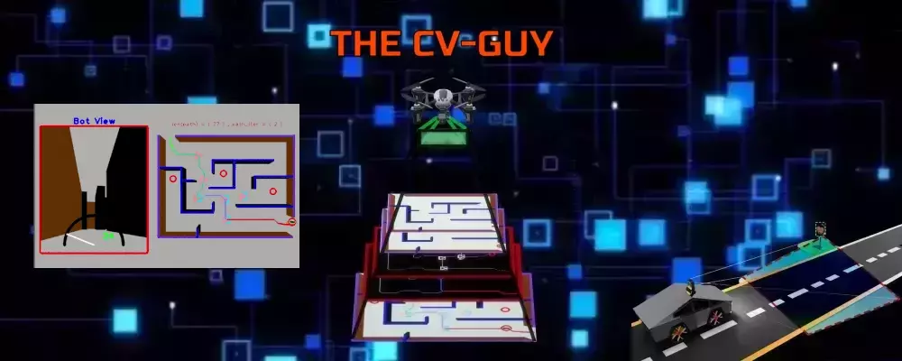

<h1 align="center">Salam 👋 , I'm Haider - aka <a href="https://www.youtube.com/channel/UCAkjl0fHhKfZno9teMjVT8A/featured">HAD-LUQ </a>
</h1> 

[][Udemy]

  

## I'm a techie, CV & AI Developer, and Udemy Instructor!!

- 🔭 Check out my latest course: [ROS2 Path Planning and Maze Solving with CV][course]!
- 🌱 I’m currently working on Precision agriculture using drones in ROS2
- 👯 I’m collaborating with @noshluk2 on many awesome projects
- 🥅 2022 Goals: Work on Visual-Slam Algorithms
- ⚡ Fun fact: I love to read/watch fiction,die from my own grenade in Warzone. 🤣

### Connect with me:

&nbsp;&nbsp;

&nbsp;&nbsp;

### Languages and Tools:
[][opencv]
[][ros]
[][python]
[][cplusplus]

 

---

###  Github Stats:
  

 

  
:zap: Recent GitHub Activity

  
<!--START_SECTION:activity-->
<!--END_SECTION:activity-->

[course]: https://www.udemy.com/course/ros2-path-planning-and-maze-solving-with-computer-vision/
[youtube]: https://www.youtube.com/channel/UCAkjl0fHhKfZno9teMjVT8A/featured
[udemy]: https://www.udemy.com/user/haider-najeeb-2/
[opencv]: https://opencv.org/
[ros]: https://www.ros.org/
[python]: https://www.python.org/
[cplusplus]: https://visualstudio.microsoft.com/vs/features/cplusplus/